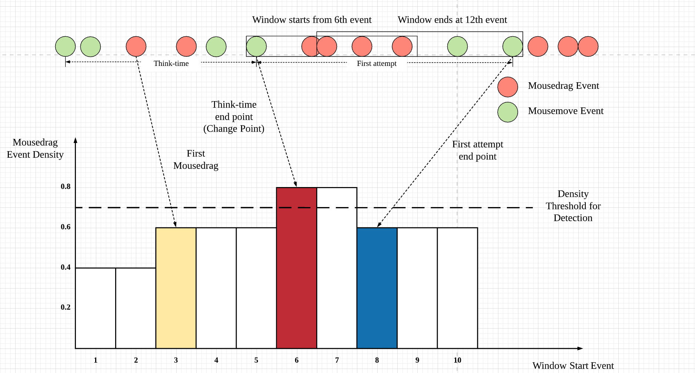

# LAK-2020
### System overview
The prediction framework contains three modules:
data collection & preprocessing module, feature extraction
module, and prediction & evaluation module. The blocks highlighted in yellow and green correspond to the major contributions of this paper.

A sample mouse movement trajectory and the Change Point Detection scheme diagram of change point detection algorithm. The 1st change point is both the think time end point and the first attempt start point. The 2nd change point is the first attempt end point.

### Backend

Data processor 
